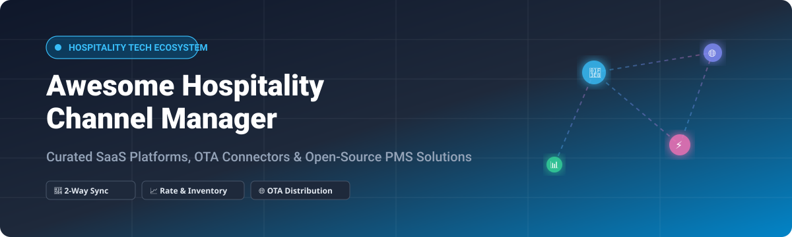

# Awesome-Hospitality-Channel-Manager 🏨⚡

  

  
  
  
  
  

---

## 🌐 Top Channel Manager (Hospitality) Platforms Ecosystem

**Curated List of SaaS Products & Open-Source GitHub Projects for Hotel Distribution, OTA Connectivity, Rate & Availability Sync, Inventory Control & Multi-Channel Booking** 🚀

*Tracked and updated for hoteliers, revenue managers, property operators, and hospitality software developers.* 📊

**Last updated: August 2026** 📅

---

### 📖 Introduction & Market Overview

This repository tracks notable **SaaS platforms** and **open-source projects** for **Hospitality Channel Managers**. These systems connect a hotel’s property management system (PMS) or central reservation system (CRS) to online travel agencies (OTAs like Booking.com, Expedia, Agoda, Airbnb), Global Distribution Systems (GDS), and metasearch engines — keeping rates, availability, and bookings synchronized in real time to prevent double bookings and optimize yield. 🏨🔄

**Examples** include SiteMinder, Cloudbeds Channel Manager (myallocator), RateGain Channel Manager, D-EDGE / Availpro, STAAH, HotelRunner, Cubilis, eZee Centrix, and RoomCloud.

> 💡 **Open-source emphasis**: Production-grade open-source hotel channel managers are extremely rare because OTA APIs are proprietary, two-way certification requirements are rigorous, and connection maintenance is complex. Useful open projects exist in hotel PMS / booking engines (e.g., QloApps, ERPNext Hospitality) and developer API bridges/wrappers.

Contributions are welcome! Please open a PR to add or update entries. 🤝

---

## 📑 Table of Contents

- [🏢 SaaS/Hosted Platforms](#-saashosted-platforms)
- [💻 Open-Source GitHub Projects](#-open-source-github-projects)
- [🛠️ Frameworks & Architecture Guide](#️-frameworks-for-building-custom-systems)
- [🤝 How to Contribute](#-how-to-contribute)
- [⭐ Star History](#-star-history)
- [⚠️ Disclaimer](#️-disclaimer)

---

## 🏢 SaaS/Hosted Platforms

> 📈 **Market Size & Structure**: The global hospitality channel management software market is valued at approximately **$1.1B–$1.8B** (growing at ~8.5%–11.0% CAGR) and is **moderately fragmented** — while category leaders (SiteMinder, Cloudbeds, RateGain, D-EDGE) hold significant international market share (~45% combined), a substantial long-tail of specialized regional and boutique providers prevents a winner-take-all monopoly.

*The table below is sorted by Company Scale / Valuation / Revenue (descending):* 💰

| Product | Description | Company Scale (Valuation / Revenue) | Starting Price | Free Tier / Trial Limits |
| :--- | :--- | :--- | :--- | :--- |
| **[SiteMinder](https://www.siteminder.com/)** | Leading global channel manager and hotel distribution platform — rules-based rate/availability control, wide OTA connectivity, and strong adoption across independent and group hotels. | **~$1.0B+ Valuation** (Public ASX: SDR, Market Cap ~AUD 955M–$1.1B, ARR ~AUD 224M+) | Starts at ~$56/month (scales with room count and selected tier) | 14-day free trial (full platform access, no credit card required) |
| **[Cloudbeds Channel Manager (myallocator)](https://www.cloudbeds.com/)** | Channel management tightly integrated with the Cloudbeds PMS — real-time sync across hundreds of OTAs, popular with independents and multi-property operators. | **~$1.0B Valuation** (Private Unicorn, ~$85M+ ARR) | Starts at ~$180/month (base package based on property room count) | No free tier; free live product demo available upon request |
| **[Cubilis](https://www.cubilis.eu/)** | European channel manager popular for connecting hotels to major OTAs and managing rates centrally (acquired by Lighthouse). | **~$1.0B Valuation** (Parent Lighthouse / OTA Insight valued at $1.0B) | Starts at ~€15–€40/month (tiered based on property room/unit count) | 14-day free trial (full channel management and booking engine access) |
| **[RateGain Channel Manager](https://rategain.com/)** | Distribution and channel management capabilities within RateGain’s broader hospitality technology portfolio, including rate intelligence and DHISCO switch. | **~$1.3B Market Cap** (Public NSE/BSE: RATEGAIN, Cap ~₹10,870 Cr / ~$1.3B) | Starts at ~$25/month (entry-level rate intelligence & distribution modules) | No free tier; free guided product demo and trial available on request |
| **[D-EDGE](https://www.d-edge.com/)** | Hospitality distribution and digital platform offering channel management, booking engine, and CRS services (Accor Group subsidiary). | **~$256M Annual Revenue** (Enterprise division of Accor Hospitality Tech) | Starts at ~€150/month (scales with room count and PMS integrations) | No free tier; custom guided demo and scheduled trial period on contract agreement |
| **[Availpro (D-EDGE)](https://www.d-edge.com/)** | Channel management and distribution technology within the D-EDGE hospitality portfolio. | **~$256M Annual Revenue** (Integrated under D-EDGE hospitality tech suite) | Starts at ~€150/month (enterprise package based on property room count) | No free tier; module-specific trial or demo available upon request |
| **[STAAH](https://www.staah.com/)** | Channel manager and hotel technology platform focused on distribution, booking engine, and connectivity for independent hotels and groups. | **~$30M ARR** (Bootstrapped global provider serving 10,000+ properties) | Starts at ~$70/month (Instant Channel Manager plan for boutique properties) | No permanent free tier; free demo available (occasional 3-month trial promotions with annual commitment) |
| **[eZee Centrix](https://www.ezeeabsolute.com/)** | Channel manager and distribution solution often paired with eZee Absolute PMS for hotels seeking unified operations and OTA connectivity. | **~$12M–$20M Revenue** (Part of Yanolja Cloud hospitality ecosystem) | Starts at $29/month (Essential tier for small properties) | 14-day free trial (full access to channel distribution and rate sync features) |
| **[HotelRunner](https://www.hotelrunner.com/)** | Channel manager and distribution platform serving hotels and alternative accommodations with multi-channel inventory sync. | **~$6M ARR / ~$35M Valuation** (Series A venture-backed distribution tech) | Starts at $19.95/month (Essential Manage) / $29.95/month (Essential Sell: 1.25% revenue fee or $29.95/mo minimum) | 14-day free trial on premium plans; basic platform tier with limited channels available |
| **[RoomCloud](https://www.roomcloud.com/)** | Channel manager focused on real-time inventory and rate distribution for independent hotels and apartments. | **~$1.5M–$3M Revenue** (Independent European hospitality specialist) | Starts at ~$25/month (or ~€25/month / ~$300/year for entry-level room tier) | 30-day free trial (full access to channel manager and multi-OTA syncing) |

---

## 💻 Open-Source GitHub Projects

*Open-source repositories, PMS cores, booking engines, and connectivity SDKs for hotel distribution. Sorted by GitHub Stars (descending):* 🌟

- **[Qloapps/QloApps](https://github.com/Qloapps/QloApps)**  🏨  
  Leading open-source hotel PMS, reservation system, and direct booking engine built on PHP/MySQL. Provides central room inventory and reservation records that serve as the foundation for custom OTA channel connectors.

- **[frappe/hospitality](https://github.com/frappe/hospitality)**  🛎️  
  Official ERPNext open-source hospitality app for managing hotel operations, room reservations, folios, restaurant point-of-sale, and billing workflows on the Frappe framework.

- **[ilgala/laravel-wubook](https://github.com/ilgala/laravel-wubook)**  🔗  
  Laravel bridge and client package for the WuBook "Wired" Channel Manager API. Enables developers to manage two-way channel availability, push rate plans, fetch OTA reservations, and automate room distribution from PHP applications.

- **[kamwoz/wubookapi-bundle](https://github.com/kamwoz/wubookapi-bundle)**  📦  
  Symfony bundle integration for the WuBook hospitality channel manager API, enabling XML-RPC communication for rates, restrictions, and bookings sync.

- **[ChannexIO/php-sdk](https://github.com/ChannexIO/php-sdk)**  ⚡  
  Official PHP SDK client library for Channex.io — modern cloud-native distribution and channel management API connecting to Booking.com, Expedia, Airbnb, and Google Hotel Ads.

- **[ChannexIO/instant_booking_page](https://github.com/ChannexIO/instant_booking_page)**  🌐  
  Open-source instant booking engine and checkout widget for hotels and vacation rentals, designed to connect directly with channel management endpoints.

- **[vBridge/laravel-icalendar](https://github.com/vBridge/laravel-icalendar)**  📅  
  Lightweight iCalendar / iCal 2-way sync utility used by small hotels, vacation rentals, and B&Bs for calendar synchronization across Airbnb, VRBO, and direct booking engines without heavy certification overhead.

- **[shentao/vue-hotel-datepicker](https://github.com/shentao/vue-hotel-datepicker)**  🗓️  
  Responsive date range picker component specifically tailored for hotel booking engines and channel reservation front-ends.

---

### 🛠️ Frameworks for Building Custom Systems

- **Open PMS as System of Record**: Treat an open PMS ([QloApps](https://github.com/Qloapps/QloApps) or ERPNext) as the inventory source of truth, then use certified commercial distribution APIs (SiteMinder, Cloudbeds, Channex, STAAH) for two-way OTA connectivity.
- **iCal Synchronization**: For low-volume vacation rentals and boutique villas, standard iCal calendar sync bridges provide a simple zero-cost alternative to full 2-way XML channels.
- **Dynamic Pricing & Revenue Management**: Build customized rate recommendation engines and yield algorithms on top of open PMS reservation databases while feeding rate updates out to distribution channels.

---

## 🤝 How to Contribute

1. 🍴 Fork the repository.
2. 📝 Add or edit entries in `README.md` following the established table and badge formats.
3. 🔗 Ensure all links, pricing details, and star badges point to valid official URLs.
4. 🚀 Submit a Pull Request with a clear explanation of your additions!

⭐ Star the repository if you find it helpful for your hospitality tech research! 🌟

---

## ⭐ Star History

---

## ⚠️ Disclaimer

- 📌 This is a **community-curated list** — provided for informational and research purposes.
- ⚡ Channel managers control live inventory and rates on major OTAs. Configuration errors can cause overbookings, inventory loss, or penalty fees. Open-source or custom distribution code must never be connected to production OTA accounts without proper testing and certification.
- 💼 Always respect each OTA's and provider's official API agreements and terms of service.

---

  Made with ❤️ for hoteliers, revenue managers, and hospitality software engineers worldwide. 🌍

